# User Guide for the Model Bank Sandbox v4.0 provided by OBL

## Table of Contents

- [Introduction](#introduction)
- [Current Version](#current-version)
- [Known Issues](#known-issues)
- [Change Log](#change-log)
- [Access Pre-Requisites](#access-pre-requisites)
- [Testing Access](#testing-access)
- [Postman](#postman)
  - [Introduction into Postman](#introduction-into-postman)
  - [Setting up Postman](#setting-up-postman)
    - [1. Install Postman](#1-install-postman)
    - [2. Import Postman Collection](#2-import-postman-collection)
    - [3. Configure MTLS Certificates](#3-configure-mtls-certificates)
    - [4. Adjust Postman General Settings](#4-adjust-postman-general-settings)
    - [5. Register Your TPP Client](#5-register-your-tpp-client)
      - [Required Claims for DCR Registration with OBL Model Bank](#required-claims-for-dcr-registration-with-obl-model-bank)
    - [6. Request the Postman Environment File](#6-request-the-postman-environment-file)
    - [7. Import Postman Environment File](#7-import-postman-environment-file)
    - [8. Configure Environment Variables](#8-configure-environment-variables)
- [Using Postman](#using-postman)
  - [Test Accounts](#test-accounts)
  - [Financial ID](#financial-id)
  - [Example of AIS Flow using Postman and OBL Model Bank](#example-of-ais-flow-using-postman-and-obl-model-bank)
- [FAPI Profile Support](#fapi-profile-support)
- [Endpoints](#endpoints)
  - [OpenID Connect Endpoints](#openid-connect-endpoints)
  - [Accounts Endpoints](#accounts-endpoints)
  - [Payment Endpoints](#payment-endpoints)
  - [Variable Recurring Payments (VRP) Endpoints](#variable-recurring-payments-vrp-endpoints)
- [Mobile Application](#mobile-application)


# Introduction

The OBL Model Bank provides provides one or more fully functional Model Banks designed to simulate a real-world Open Banking environment. Each Model Bank includes:
* A complete suite of API components (e.g. Authorization Server, Resource Server, etc.) that fully conform to the Open Banking Read/Write Standard and replicate the behaviour of production APIs.
* Synthetic test data, including example users, credentials, accounts, transactions, and more — all designed to support safe, realistic testing without involving any real customer information.

# Current Version

Current version of the OBL Model Bank is:
* 2025.17

Currently Supported version of Open Banking Read/Write Standard is:
* [v4.0.0-Update-3](https://github.com/OpenBankingUK/read-write-api-specs/tree/v4.0-Update-3)
# Known Issues

Currently there are no known issues.

# Change Log

<details>
  <summary>2025.17</summary>

*  __New GET `/environment` Endpoint Support Added:__ A new GET `/environment` endpoint has been introduced, allowing clients to generate and download a pre-configured Postman environment file for use with the Model Bank Sandbox.

* __Postman Collection Updated:__ The collection now includes a method to call the new GET `/environment` endpoint for easier access and testing.

</details>

# Access Pre-Requisites

Before onboarding onto the Ozone implementation of the OBL Model Bank, developers must first ensure they are fully familiar with all aspects of the relevan version of the [Open Banking Read/Write Standard](https://github.com/OpenBankingUK/read-write-api-specs)

To proceed with onboarding, the following prerequisites must be met:

1. The TPP is registered on the [OBL Directory Sandbox](https://directory.openbanking.org.uk/s/login/).
2. The TPP has created at least one Software Statement within the Directory Sandbox environment.
3. For each Software Statement, the TPP has generated at least one valid transport certificate.
4. For each Software Statement, the TPP has configured at least one redirect URI.
5. The TPP has downloaded and securely stored the [OBL Root and Issuing Certificates](https://github.com/OpenBankingUK/OBL-ModelBank-Integration/blob/master/attachments/OBSandBoxCACerts.zip) required for trusted communication.

# Testing Access
Before proceeding with onboarding, it's recommended that TPPs validate their MTLS setup and transport certificates using the `/.well-known/openid-configuration` and token endpoints provided by the sandbox:

1. __Fetch the OpenID Configuration__

This endpoint returns a JSON file containing key OAuth and OpenID Connect metadata, including the token endpoint:

`curl https://auth1.obie.uk.ozoneapi.io/.well-known/openid-configuration`

From the response, locate the token_endpoint field, which should point to:
`https://as1.obie.uk.ozoneapi.io/token`

2. __Validate Your Transport Certificate__

You can use the following curl command to confirm that your certificate and MTLS setup are correct. While this request will return an error (since it's not sending a full token request), it validates the certificate chain and client authentication.

`curl https://as1.obie.uk.ozoneapi.io/token \
  --cacert ca.pem \
  --key {tpp-key-file} \
  --cert {tpp-pem-file}`

* __ca.pem:__ A file containing the OBIE root and issuing certificates, chained together. [Click here to dowload ca.pem](https://github.com/OpenBankingUK/OBL-ModelBank-Integration/blob/master/attachments/ca.pem)
* __{tpp-key-file}:__ Your TPP's private key.
* __{tpp-pem-file}:__ Your transport certificate (downloaded from the OB Directory Sandbox).

A successful TLS handshake (even with an error response) confirms that your certificate is valid for use with OBL's MATLS-secured endpoints.

# Postman
## Introduction into Postman

The OBL Model Bank does not include a built-in graphical user interface (GUI). While developers can connect their own TPP applications directly to the Model Bank — as it mirrors the behaviour of real production endpoints — the recommended starting point is to use [Postman](https://www.postman.com/) to explore and test all available APIs.

This allows for quick validation of connectivity, authentication flows, and endpoint responses before integrating with your own application.

## Setting up Postman

Follow the steps below to configure Postman for interacting with the OBL Model Bank, including importing collections, environments, and setting up your certificates.

### 1. Install Postman
Download and install [Postman](https://www.postman.com/downloads) from the official website

### 2. Import Postman Collection
Download and import the latest [Postman Collection](https://github.com/OpenBankingUK/OBL-ModelBank-Integration/blob/master/attachments/UK%20OBL%20v4.0(2025.17.0).postman_collection.json)

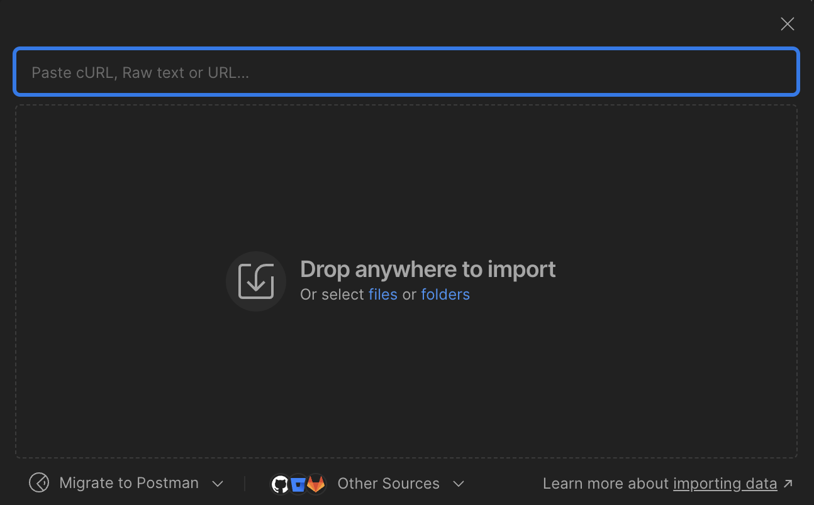

### 3. Configure MTLS Certificates
Set up your MTLS Transport Certificates in Postman:
1. Navigate to `Settings > Certificates > Add Certificate`
2. Enter the Host URL (e.g. `*.obie.uk.ozoneapi.io`)
3. Upload:
   - CRT file: Your transport certificate from the OB Directory
   - KEY file: The private key associated with that certificate

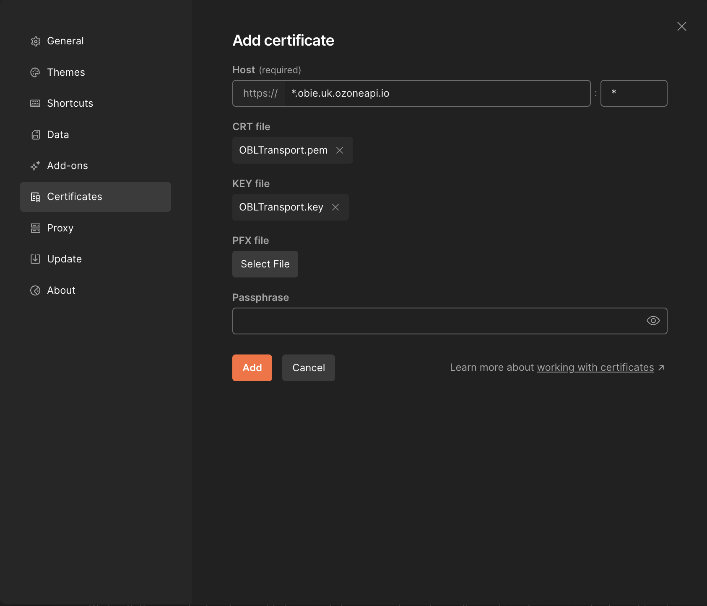

### 4. Adjust Postman General Settings
Navigate to `Settings > General` and apply the following:

- SSL certificate verification: `OFF`
- Automatically follow redirects: `ON`

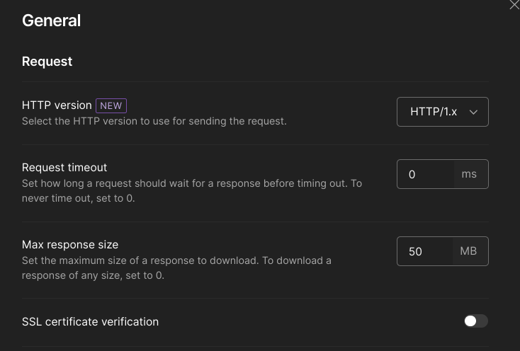
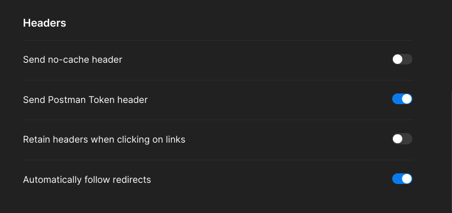


### 5. Register Your TPP Client:
Register Your TPP Client via Dynamic Client Registration (DCR).

TPP client registration must be performed using the **Dynamic Client Registration (DCR)** endpoint provided by the OBL Model Bank. The Dynamic Client Registration (DCR) request must conform to the [OpenID Connect Dynamic Client Registration](http://openid.net/specs/openid-connect-registration-1_0-21.html) specification.

- Ensure that you have your Software Statement Assertion (SSA), signing certificate, and transport certificate ready.
- Submit a registration request using DCR as per Open Banking standards.
- A successful registration will return a `client_id`, which you'll use in subsequent requests.

#### Required Claims for DCR Registration with OBL Model Bank

The following fields must be included in the registration request payload:

| Field Name                      | Example Values                                                                                                                  | Description                                                                                                                                                                                                                                                                                                                                                                                       |
| ------------------------------- | ------------------------------------------------------------------------------------------------------------------------------- | ------------------------------------------------------------------------------------------------------------------------------------------------------------------------------------------------------------------------------------------------------------------------------------------------------------------------------------------------------------------------------------------------- |
| `token_endpoint_auth_signing_alg` | `PS256`                                                                                                                         | Signature algorithm used for JWK.                                                                                                                                                                                                                                                                                                                                                                  |
| `grant_types`                     | `authorization_code`, `client_credentials`                                                                                      | Supported OAuth 2.0 grant types.                                                                                                                                                                                                                                                                                                                                                                   |
| `subject_type`                    | `public`                                                                                                                        | Subject type requested for responses to this `client_id`.                                                                                                                                                                                                                                                                                                                                         |
| `application_type`               | `web`                                                                                                                           | Type of application. Default is `web`; values can be `web` or `native`.                                                                                                                                                                                                                                                                                                                            |
| `iss`                             | Your software statement ID                                                                                                      | The issuer must match your Software Statement ID. Used to validate that the SSA aligns with the request.                                                                                                                                                                                                                                                                                          |
| `redirect_uris`                   | *(Add your registered redirect URIs)*                                                                                           | All redirect URIs must be listed in this claim.                                                                                                                                                                                                                                                                                                                                                   |
| `token_endpoint_auth_method`      | `client_secret_basic`                                                                                                           | Authentication method used at the token endpoint.                                                                                                                                                                                                                                                                                                                                                 |
| `aud`                             | `0015800001041RHAAY`                                                                                                            | Audience must match the AS issuer ID. The issuer ID for the Model Bank is: `0015800001041RHAAY`.                                                                                                                                                                                                                                                                                                  |
| `scopes`                          | `openid accounts`, `openid payments`, `accounts payments`, etc.                                                                 | Scopes depend on your FCA role:<ul><li>AISP: `openid accounts`</li><li>PISP: `openid payments`</li><li>AISP & PISP: `openid accounts payments`</li></ul>`openid` is optional.                                                                                                                                                                                                                      |
| `request_object_signing_alg`      | `none`                                                                                                                          | Algorithm used to sign request objects.                                                                                                                                                                                                                                                                                                                                                           |
| `exp`                             | *timestamp*                                                                                                                     | Expiry time of the request.                                                                                                                                                                                                                                                                                                                                                                        |
| `iat`                             | *timestamp*                                                                                                                     | Issued-at time.                                                                                                                                                                                                                                                                                                                                                                                    |
| `jti`                             | *UUID*                                                                                                                          | Unique JWT ID.                                                                                                                                                                                                                                                                                                                                                                                     |
| `response_types`                  | `code`, `code id_token`                                                                                                         | List of OAuth 2.0 response types the client will use. If omitted, defaults to `code`. See [OpenID Connect Flows Diagram](https://medium.com/@darutk/diagrams-of-all-the-openid-connect-flows-6968e3990660) for reference.                                                                                                                                                                          |
| `id_token_signed_response_alg`    | `RS256`                                                                                                                         | Algorithm for signing ID tokens.                                                                                                                                                                                                                                                                                                                                                                   |
| `software_statement`              | *(SSA JWT)*                                                                                                                     | The Software Statement Assertion (SSA) as a JWT. You can decode and inspect it using tools such as [jwt.davetonge.co.uk](https://jwt.davetonge.co.uk/).                                                                                                                                                                                                                                           |

Please, refer to the [OBL DCR specifications](https://openbankinguk.github.io/dcr-docs-pub/v3.3/dynamic-client-registration.html) for detailed validation rules and SSA content requirements.


### 6. Request the Postman Environment File

Once your TPP has completed registration via Dynamic Client Registration (DCR), you can retrieve a pre-configured Postman Environment file using the GET `/environment` endpoint:

1. In Postman, navigate to the **"Environment" folder** within the imported collection.
2. Select the GET `/environment` endpoint.
3. In the request body or parameters (depending on the implementation), **add the `client_id`** value returned from your DCR registration.
4. Click the **Send** button to execute the request.
5. Once a response is received:
   - Click the **three dots** menu (`...`) on the right-hand side of the response section.
   - Select **Save Response > Save to a file**.
6. Save the file locally. This is your tailored Postman Environment file, containing all relevant variables including server hostnames, scopes, and placeholders for certificates.
7. Import this saved environment file into Postman via `File > Import`.

This environment file will simplify further API testing by auto-populating required values across requests.

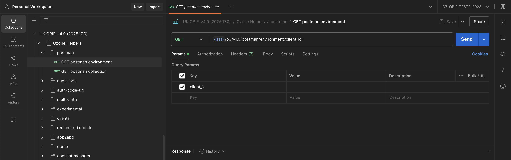

### 7. Import Postman Environment File

In Postman:

- Go to `File > Import`
- Upload both the Postman Collection and the Environment File

### 8. Configure Environment Variables

Edit the imported environment and set the following variables:

- `kid-local`: The Key ID (KID) from your jwks used in DCR request as jwks_uri
- `pem-local`: The private key of your signing certificate in single-line format

#### Convert PEM to Single Line (macOS/Linux):

```bash
tr -d '\n' < signing.key > single-line-signing.key
```
# Using Postman
## Test Accounts
The following test accounts are provided for use as Payment Debtor Accounts during sandbox testing:

<table>
<tr>
<td><b>User</b></td> <td><b>Debtor Account</b></td>
</tr>

<tr>
<td> mits </td>

<td>

```json
{
    "SchemeName" : "UK.OBIE.SortCodeAccountNumber",
    "Identification" : "10000109010102",
    "Name" : "Luigi International"
}
```

</td>

</tr>

<tr>
<td> mits </td>

<td>

```json
{
    "SchemeName" : "UK.OBIE.SortCodeAccountNumber",
    "Identification" : "10000109010103",
    "Name" : "Mario International"
}
```

</td>

</tr>

<tr>
<td> rora </td>

<td>

```json
{
    "SchemeName" : "UK.OBIE.SortCodeAccountNumber",
    "Identification" : "10000109010101",
    "Name" : "Mario International"
}
```

</td>

</tr>

</table>

## Financial ID
Next value should be used as `x-fapi-financial-id` where required:

| **x-fapi-financial-id**           |
| ------------------ |
| 0015800001041RHAAY |

## Exemple of AIS Flow using Postman and OBL Model Bank

1. Get client credentials grant access token:
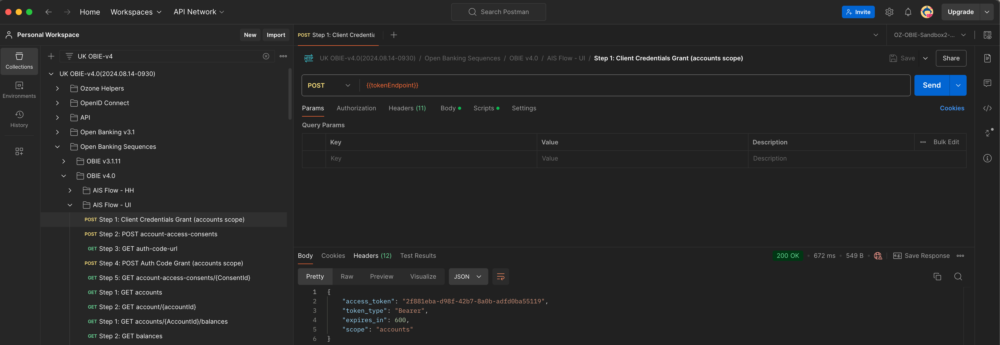


2. Create account access consent resource:
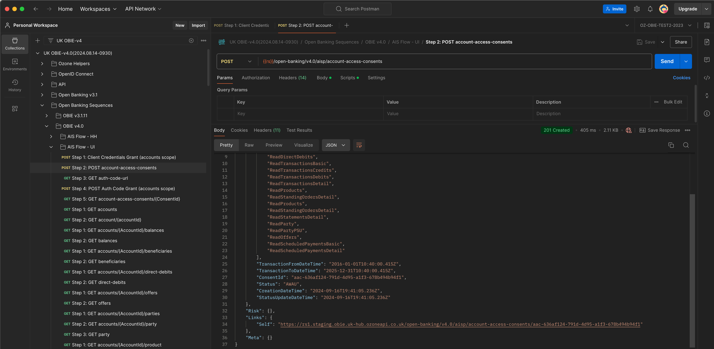


3. Generate PSU Authorisation URL:
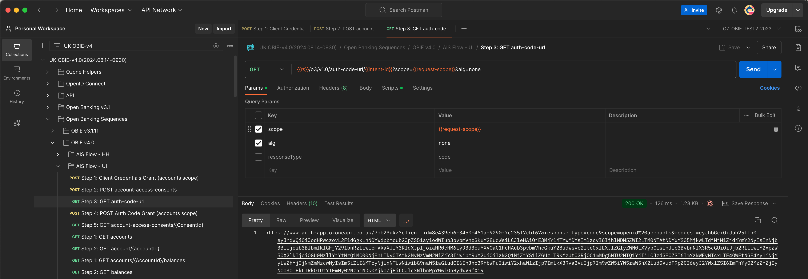

4. Authenticate the user:
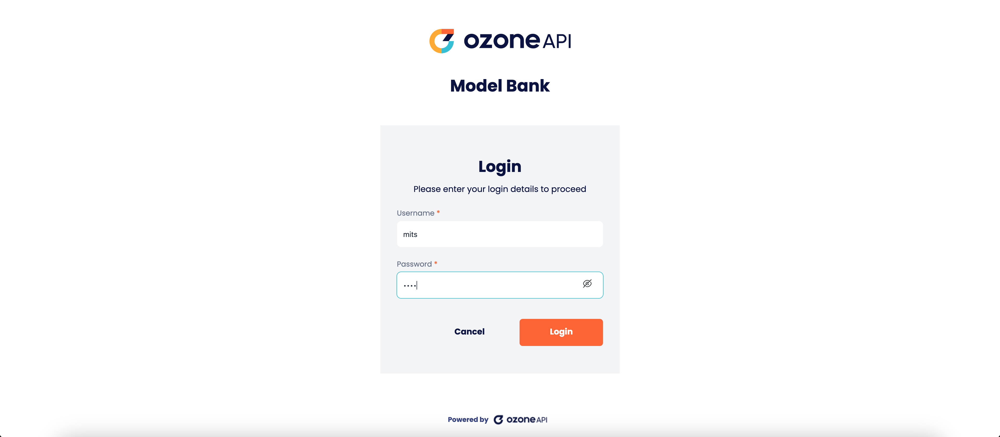


5. Select accounts:
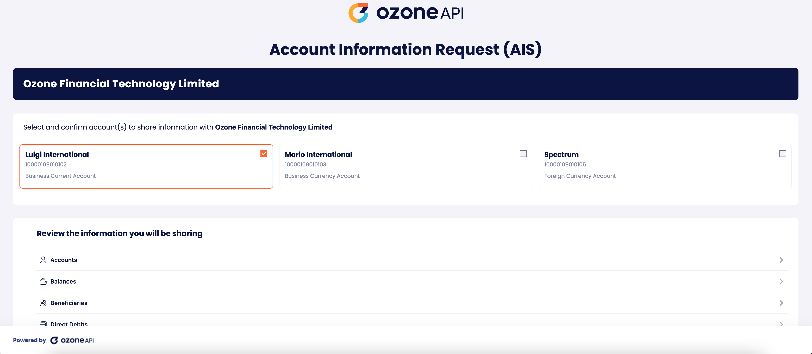


6. Copy the Authcode from the URL:


7. Generate the access token using Authcode:
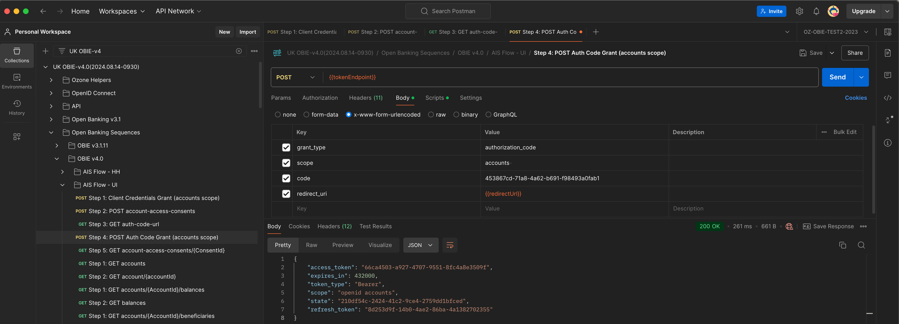


8. Retrieve Account Data:
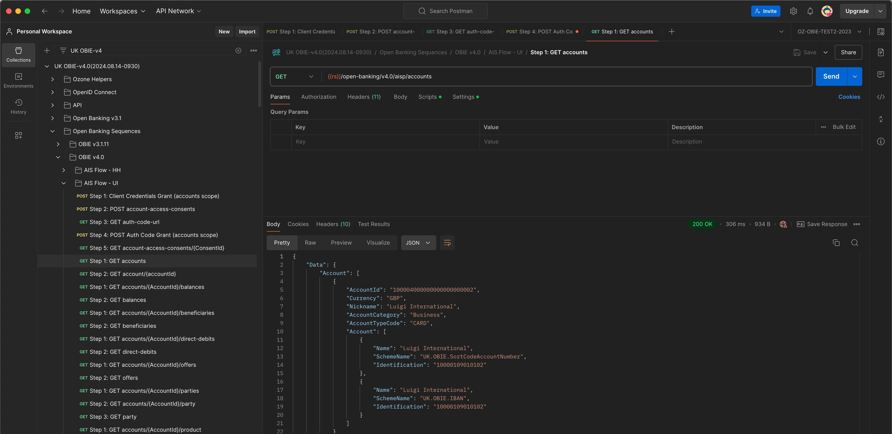


9. Retrieve Transaction Data:
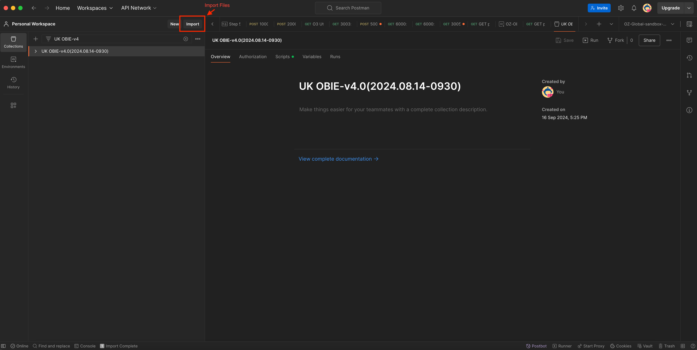


# FAPI Profile support
Currently, the Sandbox provides parallel running for versions v3.1.11 and v4.0, both with **FAPI 1.0 Advanced Profile** enabled.

# Endpoints
Currently, two instances of the Model Bank are available providing support for both version v3.1.11 and v4.0. For 3.1.11 endpoint URLs, please see [Model Bank v3.1.11 documentation](https://github.com/OpenBankingUK/OBL-ModelBank-Integration/tree/v3.1.11).

## OpenID Connect endpoints

| Item                   | All Versions                                                                                                                                                                               |
| ---------------------- | ------------------------------------------------------------------------------------------------------------------------------------------------------------------------------------------ |
| Well-known endpoint    | [https://auth1.obie.uk.ozoneapi.io/.well-known/openid-configuration](https://auth1.obie.uk.ozoneapi.io/.well-known/openid-configuration)                                                   |
| Dynamic registration   | [https://rs1.obie.uk.ozoneapi.io/dynamic-client-registration/v3.2/register](https://rs1.obie.uk.ozoneapi.io/dynamic-client-registration/v3.2/register) |
| Token endpoint         | [https://as1.obie.uk.ozoneapi.io/token](https://as1.obie.uk.ozoneapi.io/token)                                                                                                             |
| Authorization endpoint | [https://auth1.obie.uk.ozoneapi.io/auth](https://auth1.obie.uk.ozoneapi.io/auth)                                                                                                           |

## Accounts endpoints

| Item                  |  v4.0                                                                                                                                                            |
| --------------------- | ---------------------------------------------------------------------------------------------------------------------------------------------------------------- |
| Post-Account requests | [https://rs1.obie.uk.ozoneapi.io/open-banking/v4.0/aisp/account-access-consents](https://rs1.obie.uk.ozoneapi.io/open-banking/v4.0/aisp/account-access-consents) |
| Accounts              | [https://rs1.obie.uk.ozoneapi.io/open-banking/v4.0/aisp/accounts](https://rs1.obie.uk.ozoneapi.io/open-banking/v4.0/aisp/accounts)                               |
| Transactions          | [https://rs1.obie.uk.ozoneapi.io/open-banking/v4.0/aisp/transactions](https://rs1.obie.uk.ozoneapi.io/open-banking/v4.0/aisp/transactions)                       |
| Balances              | [https://rs1.obie.uk.ozoneapi.io/open-banking/v4.0/aisp/balances](https://rs1.obie.uk.ozoneapi.io/open-banking/v4.0/aisp/balances)                               |
| Beneficiaries         | [https://rs1.obie.uk.ozoneapi.io/open-banking/v4.0/aisp/beneficiaries](https://rs1.obie.uk.ozoneapi.io/open-banking/v4.0/aisp/beneficiaries)                     |
| Direct-Debits         | [https://rs1.obie.uk.ozoneapi.io/open-banking/v4.0/aisp/direct-debits](https://rs1.obie.uk.ozoneapi.io/open-banking/v4.0/aisp/direct-debits)                     |
| Products              | [https://rs1.obie.uk.ozoneapi.io/open-banking/v4.0/aisp/products](https://rs1.obie.uk.ozoneapi.io/open-banking/v4.0/aisp/products)                               |
| Standing-Orders       | [https://rs1.obie.uk.ozoneapi.io/open-banking/v4.0/aisp/standing-orders](https://rs1.obie.uk.ozoneapi.io/open-banking/v4.0/aisp/standing-orders)                 |

## Payment endpoints

| Item                                     | v4.0                                                                                                                                                                                               |
| ---------------------------------------- | -------------------------------------------------------------------------------------------------------------------------------------------------------------------------------------------------- |
| Domestic Payments Consent                | [https://rs1.obie.uk.ozoneapi.io/open-banking/v4.0/pisp/domestic-payment-consents](https://rs1.obie.uk.ozoneapi.io/open-banking/v4.0/pisp/domestic-payment-consents)                               |
| Domestic Payments                        | [https://rs1.obie.uk.ozoneapi.io/open-banking/v4.0/pisp/domestic-payments](https://rs1.obie.uk.ozoneapi.io/open-banking/v4.0/pisp/domestic-payments)                                               |
| Domestic Scheduled Payments Consent      | [https://rs1.obie.uk.ozoneapi.io/open-banking/v4.0/pisp/domestic-scheduled-payment-consents](https://rs1.obie.uk.ozoneapi.io/open-banking/v4.0/pisp/domestic-scheduled-payment-consents)           |
| Domestic Scheduled Payments              | [https://rs1.obie.uk.ozoneapi.io/open-banking/v4.0/pisp/domestic-scheduled-payments](https://rs1.obie.uk.ozoneapi.io/open-banking/v4.0/pisp/domestic-scheduled-payments)                           |
| Domestic Standing Orders Consent         | [https://rs1.obie.uk.ozoneapi.io/open-banking/v4.0/pisp/domestic-standing-order-consents](https://rs1.obie.uk.ozoneapi.io/open-banking/v4.0/pisp/domestic-standing-order-consents)                 |
| Domestic Standing Orders                 | [https://rs1.obie.uk.ozoneapi.io/open-banking/v4.0/pisp/domestic-standing-orders](https://rs1.obie.uk.ozoneapi.io/open-banking/v4.0/pisp/domestic-standing-orders)                                 |
| International Payments Consent           | [https://rs1.obie.uk.ozoneapi.io/open-banking/v4.0/pisp/international-payment-consents](https://rs1.obie.uk.ozoneapi.io/open-banking/v4.0/pisp/international-payment-consents)                     |
| International Payments                   | [https://rs1.obie.uk.ozoneapi.io/open-banking/v4.0/pisp/international-payments](https://rs1.obie.uk.ozoneapi.io/open-banking/v4.0/pisp/international-payments)                                     |
| International Scheduled Payments Consent | [https://rs1.obie.uk.ozoneapi.io/open-banking/v4.0/pisp/international-scheduled-payment-consents](https://rs1.obie.uk.ozoneapi.io/open-banking/v4.0/pisp/international-scheduled-payment-consents) |
| International Scheduled Payments         | [https://rs1.obie.uk.ozoneapi.io/open-banking/v4.0/pisp/international-scheduled-payments](https://rs1.obie.uk.ozoneapi.io/open-banking/v4.0/pisp/international-scheduled-payments)                 |
| International Standing Orders Consent    | [https://rs1.obie.uk.ozoneapi.io/open-banking/v4.0/pisp/international-standing-order-consents](https://rs1.obie.uk.ozoneapi.io/open-banking/v4.0/pisp/international-standing-order-consents)       |
| International Standing Orders            | [https://rs1.obie.uk.ozoneapi.io/open-banking/v4.0/pisp/international-standing-orders](https://rs1.obie.uk.ozoneapi.io/open-banking/v4.0/pisp/international-standing-orders)                       |

## <a name="vrpendpoints"></a>Variable Recurring Payments (VRP) endpoints
At the moment, the Model Bank v4.0 does not support the new PUT VRP or PATCH VRP endpoints introduced to allow VRP consent data to be migrated from the v3.1.x standards to the new v4.0 data schemas. These two new v4.0 VRP endpoints will be supported in a future Model Bank release.

| Item                 | v4.0                                                                                                                                                         |
| -------------------- | ------------------------------------------------------------------------------------------------------------------------------------------------------------ |
| Domestic VRP Consent | [https://rs1.obie.uk.ozoneapi.io/open-banking/v4.0/pisp/domestic-vrp-consents](https://rs1.obie.uk.ozoneapi.io/open-banking/v4.0/pisp/domestic-vrp-consents) |
| Domestic VRP         | [https://rs1.obie.uk.ozoneapi.io/open-banking/v4.0/pisp/domestic-vrps](https://rs1.obie.uk.ozoneapi.io/open-banking/v4.0/pisp/domestic-vrps)                 |

## Mobile Application

At the moment Ozone Authenticator Mobile App does not support Model Bank v4.0. Support will be added in further Model Bank releases.
For support for v3.1.11, please see [Model Bank v3.1.11 documentation](https://github.com/OpenBankingUK/OBL-ModelBank-Integration/tree/v3.1.11).
