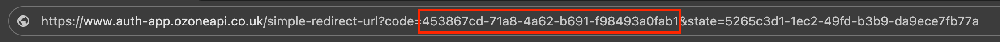

# Integrating a TPP with the Model Bank v4.0 provided by OBIE

- [Postman Collection](#Postman-Collection)</br>
- [FAPI Profile support](#FAPI-Profile-support)</br>
- [Endpoints](#Endpoints)
    - [OpenID Connect endpoints](#OpenID-Connect-endpoints)
    - [Accounts endpoints](#Accounts-endpoints)
    - [Payment endpoints](#Payment-endpoints)
    - [Variable Recurring Payments (VRP) endpoints](#vrpendpoints)
- [Payment Debtor Test Accounts](#Payment-Debtor-Test-Accounts)
- [Financial ID](#Financial-ID)
- [Mobile Application](#Mobile-Application)
- [Step-by-step guide](#Step-by-step-guide)
    - [Step 1: Pre-Requisites (TPP)](#prereq)
    - [Step 2: Test TPP Transport Certificates (TPP)](#test_tpp)
    - [Step 3: Setup TPP On Model Bank (TPP/Open Banking)](#setup)
        - [3.1 Dynamic Client Registration (TPP)](#dcr)
    - [Step 4: Import Environment Files and Collections To Postman (TPP)](#import_postman)
    - [Step 5: PSU Authenticate and Authorize(Open Banking and TPP)](#psu_auth)
    - [Step 6: Steps in  PSU Consent](#psu_consent)
    - [Step 7: Retrieve Account and Transaction Data (TPP)](#retrieve)

</br>
Open Banking (OB) offers the capability for TPPs to integrate with model banks -  Bank1 and Bank2. This model bank supports Open Banking Read/Write Standard v4.0.
</br>
</br>

# Postman Collection

This allows the various authentication and authorisation flow to be tested and some basic AISP and PISP functionality to be executed, as per the OB specifications.

[Postman](https://www.getpostman.com/) can be used to test the flows and APIs prior to building a TPP client. 

The steps below will help TPPs validate their setup and help better understand the various security flows required to integrate their own applications within the Open Banking ecosystem.

Ozone Model Bank Collection Files

[UK OBL v4.0.postman_collection.json](./attachments/UK%20OBL%20v4.0.postman_collection.json)

# FAPI Profile support 
Currently, the Sandbox provides parallel running for versions v3.1.11 and v4.0, both with **FAPI 1.0 Advanced Profile** enabled.

# Endpoints
Currently, the Sandbox provides parallel running for versions v3.1.11 and v4.0. For 3.1.11 enpoint URLs, please see [Model Bank v3.1.11 documentation](https://github.com/OpenBankingUK/OBL-ModelBank-Integration/tree/v3.1.11).

## OpenID Connect endpoints

| Item                   | All Versions                                                                                                                                                                               |
| ---------------------- | ------------------------------------------------------------------------------------------------------------------------------------------------------------------------------------------ |
| Well-known endpoint    | [https://auth1.obie.uk.ozoneapi.io/.well-known/openid-configuration](https://auth1.obie.uk.ozoneapi.io/.well-known/openid-configuration)                                                   |
| Dynamic registration   | [https://rs1.obie.uk.ozoneapi.io/dynamic-client-registration/v3.2/register](https://rs1.obie.uk.ozoneapi.io/dynamic-client-registration/v3.2/register) |
| Token endpoint         | [https://as1.obie.uk.ozoneapi.io/token](https://as1.obie.uk.ozoneapi.io/token)                                                                                                             |
| Authorization endpoint | [https://auth1.obie.uk.ozoneapi.io/auth](https://auth1.obie.uk.ozoneapi.io/auth)                                                                                                           |

## Accounts endpoints

| Item                  |  v4.0                                                                                                                                                            |
| --------------------- | ---------------------------------------------------------------------------------------------------------------------------------------------------------------- |
| Post-Account requests | [https://rs1.obie.uk.ozoneapi.io/open-banking/v4.0/aisp/account-access-consents](https://rs1.obie.uk.ozoneapi.io/open-banking/v4.0/aisp/account-access-consents) |
| Accounts              | [https://rs1.obie.uk.ozoneapi.io/open-banking/v4.0/aisp/accounts](https://rs1.obie.uk.ozoneapi.io/open-banking/v4.0/aisp/accounts)                               |
| Transactions          | [https://rs1.obie.uk.ozoneapi.io/open-banking/v4.0/aisp/transactions](https://rs1.obie.uk.ozoneapi.io/open-banking/v4.0/aisp/transactions)                       |
| Balances              | [https://rs1.obie.uk.ozoneapi.io/open-banking/v4.0/aisp/balances](https://rs1.obie.uk.ozoneapi.io/open-banking/v4.0/aisp/balances)                               |
| Beneficiaries         | [https://rs1.obie.uk.ozoneapi.io/open-banking/v4.0/aisp/beneficiaries](https://rs1.obie.uk.ozoneapi.io/open-banking/v4.0/aisp/beneficiaries)                     |
| Direct-Debits         | [https://rs1.obie.uk.ozoneapi.io/open-banking/v4.0/aisp/direct-debits](https://rs1.obie.uk.ozoneapi.io/open-banking/v4.0/aisp/direct-debits)                     |
| Products              | [https://rs1.obie.uk.ozoneapi.io/open-banking/v4.0/aisp/products](https://rs1.obie.uk.ozoneapi.io/open-banking/v4.0/aisp/products)                               |
| Standing-Orders       | [https://rs1.obie.uk.ozoneapi.io/open-banking/v4.0/aisp/standing-orders](https://rs1.obie.uk.ozoneapi.io/open-banking/v4.0/aisp/standing-orders)                 |

## Payment endpoints

| Item                                     | v4.0                                                                                                                                                                                               |
| ---------------------------------------- | -------------------------------------------------------------------------------------------------------------------------------------------------------------------------------------------------- |
| Domestic Payments Consent                | [https://rs1.obie.uk.ozoneapi.io/open-banking/v4.0/pisp/domestic-payment-consents](https://rs1.obie.uk.ozoneapi.io/open-banking/v4.0/pisp/domestic-payment-consents)                               |
| Domestic Payments                        | [https://rs1.obie.uk.ozoneapi.io/open-banking/v4.0/pisp/domestic-payments](https://rs1.obie.uk.ozoneapi.io/open-banking/v4.0/pisp/domestic-payments)                                               |
| Domestic Scheduled Payments Consent      | [https://rs1.obie.uk.ozoneapi.io/open-banking/v4.0/pisp/domestic-scheduled-payment-consents](https://rs1.obie.uk.ozoneapi.io/open-banking/v4.0/pisp/domestic-scheduled-payment-consents)           |
| Domestic Scheduled Payments              | [https://rs1.obie.uk.ozoneapi.io/open-banking/v4.0/pisp/domestic-scheduled-payments](https://rs1.obie.uk.ozoneapi.io/open-banking/v4.0/pisp/domestic-scheduled-payments)                           |
| Domestic Standing Orders Consent         | [https://rs1.obie.uk.ozoneapi.io/open-banking/v4.0/pisp/domestic-standing-order-consents](https://rs1.obie.uk.ozoneapi.io/open-banking/v4.0/pisp/domestic-standing-order-consents)                 |
| Domestic Standing Orders                 | [https://rs1.obie.uk.ozoneapi.io/open-banking/v4.0/pisp/domestic-standing-orders](https://rs1.obie.uk.ozoneapi.io/open-banking/v4.0/pisp/domestic-standing-orders)                                 |
| International Payments Consent           | [https://rs1.obie.uk.ozoneapi.io/open-banking/v4.0/pisp/international-payment-consents](https://rs1.obie.uk.ozoneapi.io/open-banking/v4.0/pisp/international-payment-consents)                     |
| International Payments                   | [https://rs1.obie.uk.ozoneapi.io/open-banking/v4.0/pisp/international-payments](https://rs1.obie.uk.ozoneapi.io/open-banking/v4.0/pisp/international-payments)                                     |
| International Scheduled Payments Consent | [https://rs1.obie.uk.ozoneapi.io/open-banking/v4.0/pisp/international-scheduled-payment-consents](https://rs1.obie.uk.ozoneapi.io/open-banking/v4.0/pisp/international-scheduled-payment-consents) |
| International Scheduled Payments         | [https://rs1.obie.uk.ozoneapi.io/open-banking/v4.0/pisp/international-scheduled-payments](https://rs1.obie.uk.ozoneapi.io/open-banking/v4.0/pisp/international-scheduled-payments)                 |
| International Standing Orders Consent    | [https://rs1.obie.uk.ozoneapi.io/open-banking/v4.0/pisp/international-standing-order-consents](https://rs1.obie.uk.ozoneapi.io/open-banking/v4.0/pisp/international-standing-order-consents)       |
| International Standing Orders            | [https://rs1.obie.uk.ozoneapi.io/open-banking/v4.0/pisp/international-standing-orders](https://rs1.obie.uk.ozoneapi.io/open-banking/v4.0/pisp/international-standing-orders)                       |

## <a name="vrpendpoints"></a>Variable Recurring Payments (VRP) endpoints

| Item                 | v4.0                                                                                                                                                         |
| -------------------- | ------------------------------------------------------------------------------------------------------------------------------------------------------------ |
| Domestic VRP Consent | [https://rs1.obie.uk.ozoneapi.io/open-banking/v4.0/pisp/domestic-vrp-consents](https://rs1.obie.uk.ozoneapi.io/open-banking/v4.0/pisp/domestic-vrp-consents) |
| Domestic VRP         | [https://rs1.obie.uk.ozoneapi.io/open-banking/v4.0/pisp/domestic-vrps](https://rs1.obie.uk.ozoneapi.io/open-banking/v4.0/pisp/domestic-vrps)                 |


## Payment Debtor Test Accounts

<table>
<tr>
<td><b>User</b></td> <td><b>Debtor Account</b></td>
</tr>

<tr>
<td> mits </td>

<td>

```json
{
    "SchemeName" : "UK.OBIE.SortCodeAccountNumber",
    "Identification" : "10000109010102",
    "Name" : "Luigi International"
}
```

</td>

</tr>

<tr>
<td> mits </td>

<td>

```json
{
    "SchemeName" : "UK.OBIE.SortCodeAccountNumber",
    "Identification" : "10000109010103",
    "Name" : "Mario International"
}
```

</td>

</tr>

<tr>
<td> rora </td>

<td>

```json
{
    "SchemeName" : "UK.OBIE.SortCodeAccountNumber",
    "Identification" : "10000109010101",
    "Name" : "Mario International"
}
```

</td>

</tr>

</table>

## **Financial ID**
Used in x-fapi-financial-id header where requred.

| **Item**           |
| ------------------ |
| 0015800001041RHAAY |

## Mobile Application

At the moment Ozone Authenticator Mobile App do not support Model Bank v4.0. Support will be added in further Model Bank releases. 
For support for v3.1.11, please see [Model Bank v3.1.11 documentation](https://github.com/OpenBankingUK/OBL-ModelBank-Integration/tree/v3.1.11).


# Step-by-step guide

## <a name="prereq"></a>Step 1: Pre-Requisites (TPP)

Ensure that the following pre-requisites are met before onboarding onto Ozone.

1. The TPP has registered on the [Directory Sandbox](https://directory.openbanking.org.uk/s/login/)
2. The TPP has at least one software statement created on the Directory Sandbox environment
3. The TPP has at least one transport certificate created for each of its software statements.
4. The TPP has at least one redirect URI for each of its software statements.
5. The TPP has a copy of the OB root and issuing certificate attached. 

[OBSandBoxCACerts.zip](./attachments/OBSandBoxCACerts.zip)

## <a name="test_tpp"></a>Step 2: Test TPP Transport Certificates (TPP)

Testing the well know endpoint below returns a json file which contains a list of endpoints.

```
curl https://auth1.obie.uk.ozoneapi.io/.well-known/openid-configuration
```

One of these json endpoints is the token endpoint which you can use to validate your certificates.

[https://as1.obie.uk.ozoneapi.io/token](https://as1.obie.uk.ozoneapi.io/token)

The TPP should run the following check to ensure that it has a valid certificate:

``` 
curl https://as1.obie.uk.ozoneapi.io/token
-cacert ca.pem
-key {tpp-key-file}
-cert {tpp-pem-file}
```

Here, `tpp-key-file` is the file that contains the TPPs private key and `tpp-cert-file` contains the transport certificate (downloaded from Sandbox).

This will return an error response but proves that your certificates are valid against the MATLS endpoint.
Here, the `ca.pem` file contains the Open Banking issuing and root certificate chained together into a single file.

[ca.pem](./attachments/ca.pem)

## <a name="setup"></a>Step 3: Setup TPP On Model Bank (TPP/Open Banking)

Ozone banks allow TPP to onboard via dynamic client registration.

### <a name="dcr"></a>3.1 Dynamic Client Registration (TPP)

See [http://openid.net/specs/openid-connect-registration-1_0-21.html](http://openid.net/specs/openid-connect-registration-1_0-21.html) 

Claims required in dynamic client registration for Ozone Banks:


| Field Name                      | Example Values                                                                                                                  | Description                                                                                                                                                                                                                                                                                                                                                                                       |
| ------------------------------- | ------------------------------------------------------------------------------------------------------------------------------- | ------------------------------------------------------------------------------------------------------------------------------------------------------------------------------------------------------------------------------------------------------------------------------------------------------------------------------------------------------------------------------------------------- |
| token_endpoint_auth_signing_alg | `PS256`                                                                                                                         | Signature algorithm used JWK.                                                                                                                                                                                                                                                                                                                                                                     |
| grant_types                     | authorization_code, client_credentials                                                                                          |                                                                                                                                                                                                                                                                                                                                                                                                   |
| subject_type                    | public                                                                                                                          | subject_type requested for responses to this client_id.                                                                                                                                                                                                                                                                                                                                           |
| application_type                | web                                                                                                                             | Kind of the application. The default if not specified is web. The defined values are native or web.                                                                                                                                                                                                                                                                                               |
| iss                             | software statement id                                                                                                           | The issuer must be your software ID. This is important as it's used verify it matches the SSA software ID claim.                                                                                                                                                                                                                                                                                  |
| redirect_uris                   |                                                                                                                                 | All redirect Uris should be added in the claims                                                                                                                                                                                                                                                                                                                                                   |
| token_endpoint_auth_method      | `client_secret_basic`                                                                                                           | Requested authentication method for the Token Endpoint.                                                                                                                                                                                                                                                                                                                                           |
| aud                             | `0015800001041RHAAY`                                                                                                            | The audience must match the AS issuer ID. Modelo bank's issuer ID is:<br>0015800001041RHAAY</br>                                                                                                                                                                                                                                                                                                           |
| scopes                          | <br>‘openid and accounts' or 'accounts’</br><br>‘openid and payments' or 'payments</br><br>’‘openid,accounts and payments' or 'accounts and payments’</br> | The scopes will depend on your role from the FCA (AISP and/or PISP):<ul><li>AISP: openid and accounts</li><li>PISP: openid and payments</li><li>AISP and PISP: openid, accounts and payments</li></ul>Refer to examples. Openid is optional                                                                                                                                                                                |
| request_object_signing_alg      | none                                                                                                                            |                                                                                                                                                                                                                                                                                                                                                                                                   |
| exp                             | timestamp                                                                                                                       |                                                                                                                                                                                                                                                                                                                                                                                                   |
| iat                             | timestamp                                                                                                                       |                                                                                                                                                                                                                                                                                                                                                                                                   |
| jti                             |                                                                                                                                 | UUID                                                                                                                                                                                                                                                                                                                                                                                              |
| response_types                  | code, code id_token                                                                                                             | JSON array containing a list of the OAuth 2.0 response_type values that the Client is declaring that it will restrict itself to using. If omitted, the default is that the Client will use only the code response type. See: [https://medium.com/@darutk/diagrams-of-all-the-openid-connect-flows-6968e3990660](https://medium.com/@darutk/diagrams-of-all-the-openid-connect-flows-6968e3990660) |
| id_token_signed_response_alg    | RS256                                                                                                                           | JWS algorithm                                                                                                                                                                                                                                                                                                                                                                                 |
| software_statement              |                                                                                                                                 | Since the SSA is essentially a JWT, you can decode it (for example, using [https://jwt.davetonge.co.uk/](https://jwt.davetonge.co.uk/)).                                                                                                                                                                                                                                                          |


## <a name="import_postman">Step 4: Import Environment Files and Collections To Postman (TPP)

### 4.1 Import Collections and setup Enviroment in Postman (TPP)


 


### 4.2 Check URLs and Environments are loaded successfully (TPP)


### 4.3 Add Client Certificates

Add the following Modelo and Referenco bank endpoints into Postman;

**.obie.uk.ozoneapi.io:**


The CRT should be set to the transport certificate downloaded from the open banking directory. The Key value should be set to the private key for the transport certificate.


### 4.4 SSL Certificate Verification (TPP)

**In Postman settings, ensure SSL Certificate Verification is set to off.**

## <a name="psu_auth">Step 5: PSU Authenticate and Authorize(Open Banking and TPP)

### 5.1 Client Credentials Grant (TPP)


### 5.2 Account Access Consent(TPP)


### 5.3 PSU Consent Flow(Open Banking and TPP)

TPPs can initiate the consent authorisation flow URL via Postman.


Once the URL is constructed, open the URL to initiate the PSU consent flow.


## <a name="psu_consent">6: Steps in  PSU Consent

### 6.1 Authenticate the user (Open Banking)


### 6.2 Select accounts (Open Banking)


Once the PSU consent is successful, Ozone Bank will redirect back to the redirect URI.

### 6.3 Copy the Authcode from the URL (Open Banking)





### 6.4 Generate the access token (TPP)


## <a name="retrieve">Step 7: Retrieve Account and Transaction Data (TPP)

### 7.1 Retrieve Account Data


### 7.2 Retrieve Transaction Data


